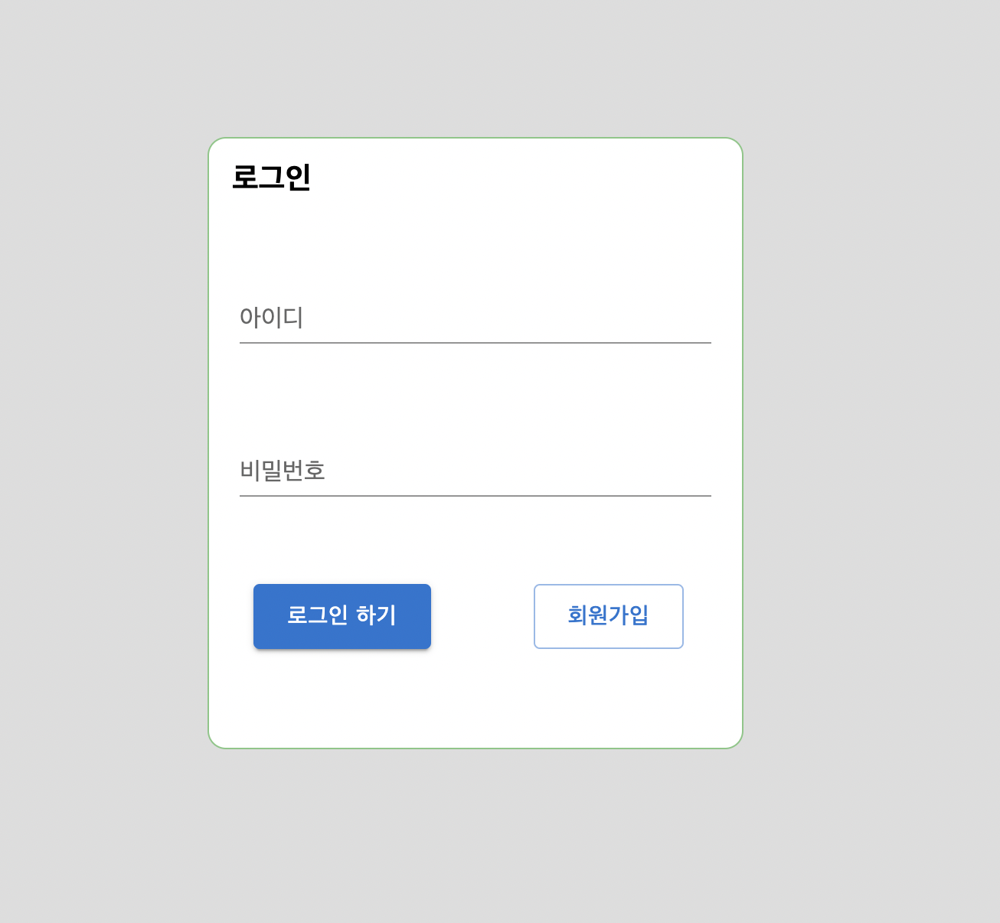
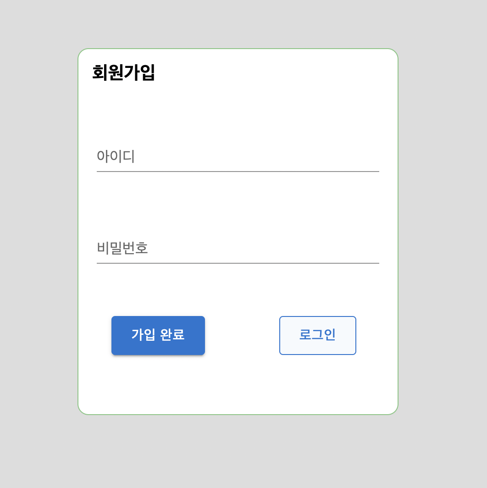
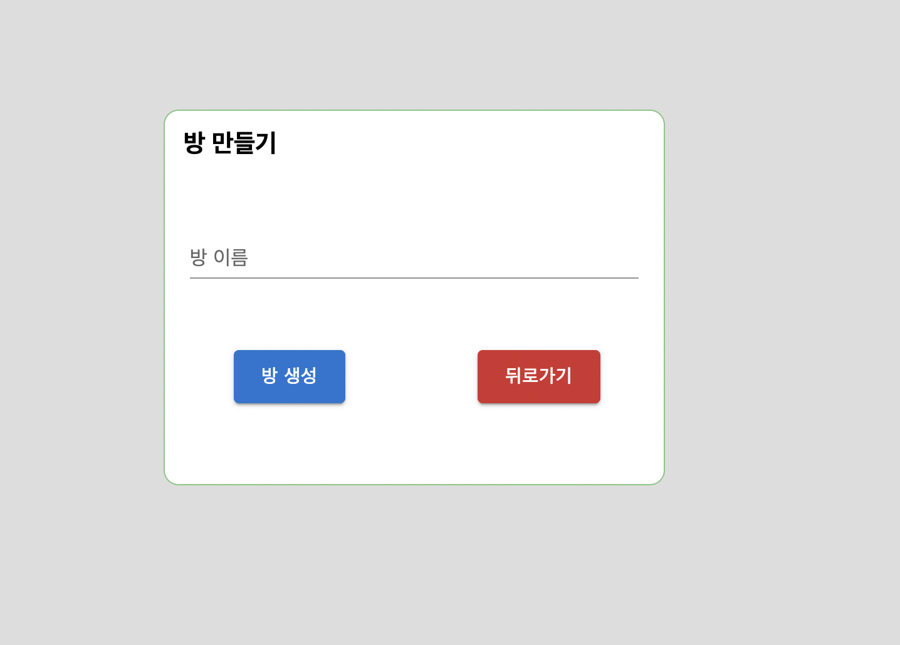
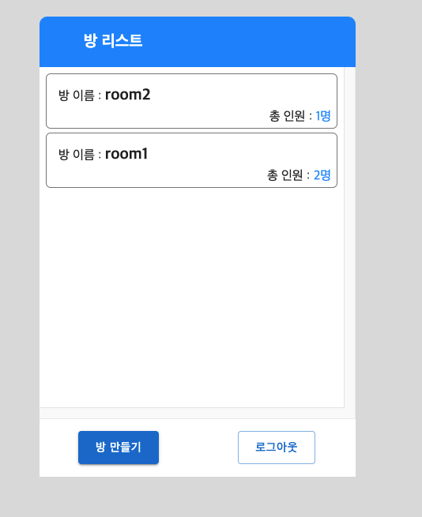
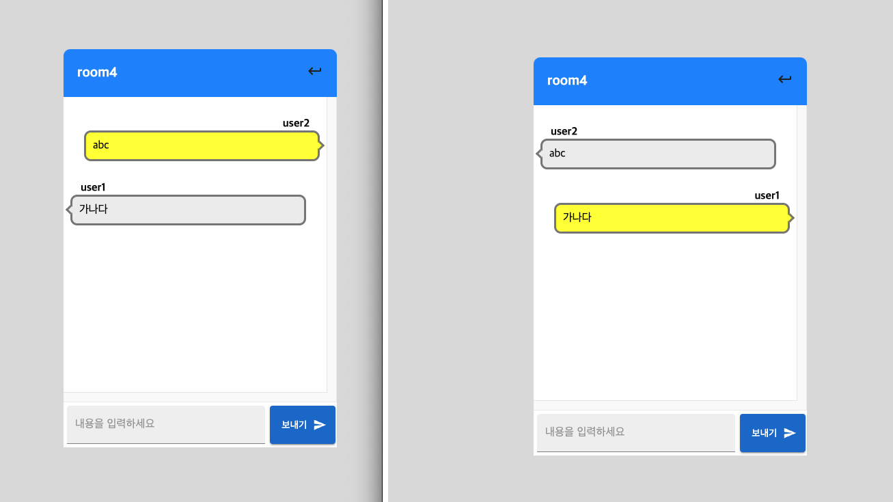

# toy-chat-project

## 이미지







## chat-server

### <span style="color:grey">_사용 기술_</span>

ExpressJs, TypeScript, SocketIo, MySQL, Sequelize,

### <span style="color:grey">_.env 파일 추가_</span>

```
PORT=8000

JWT_SECRET='JWT 비밀키 적용';

MYSQL_DATABASE='database 이름'
MYSQL_HOST='db host 명'
MYSQL_PASSWORD='db password 명'

```

### <span style="color:grey">사용 방법</span>

1. git clone root-repository (해당 프로젝트 클론)
2. cd chat-server (Express 서버로 이동)
3. npm install (라이브러리 다운로드)
4. npm run start (서버 실행)

## chat-client

### <span style="color:grey">_사용 기술_</span>

Redux, Redux-Saga, socket.io-client, Styled-Component

### <span style="color:grey">사용 방법</span>

1. git clone root-repository (해당 프로젝트 클론)
2. cd chat-client (React 프로젝트 폴더로 이동)
3. npm install (라이브러리 다운로드)
4. npm run start (서버 실행)
